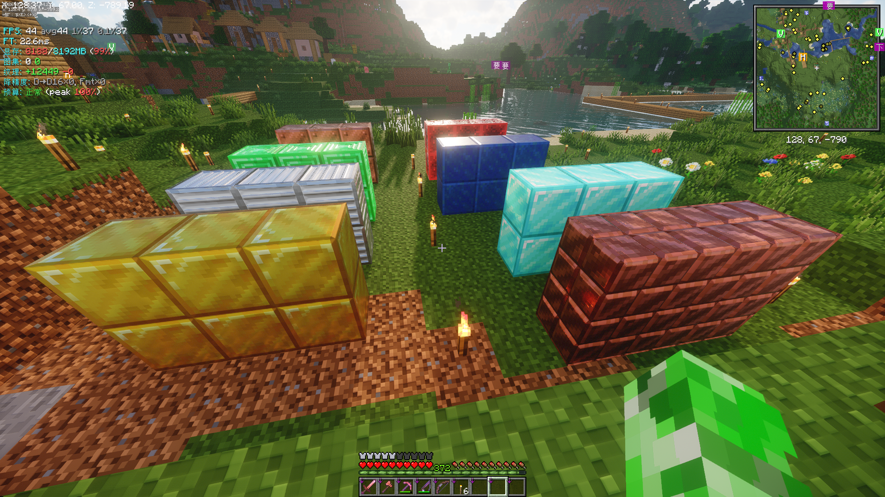
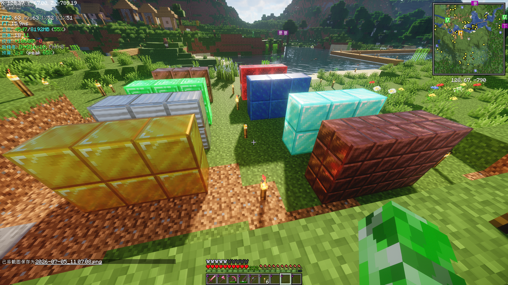
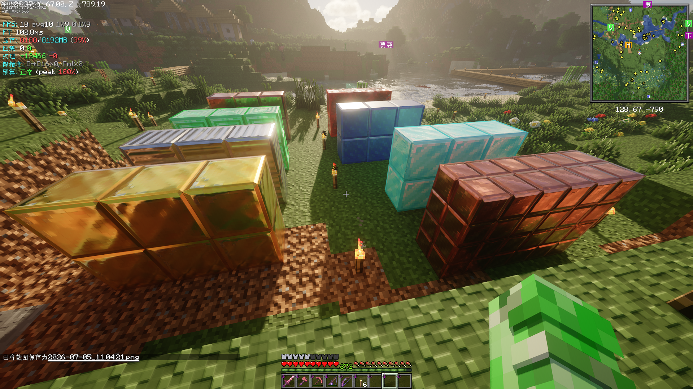
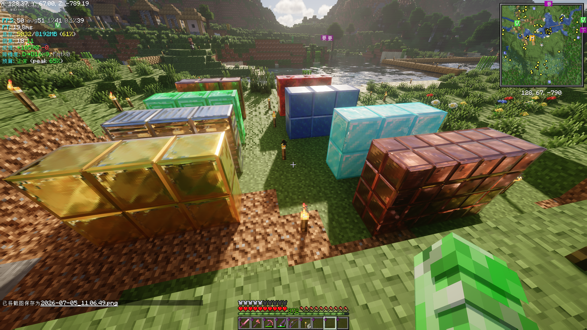
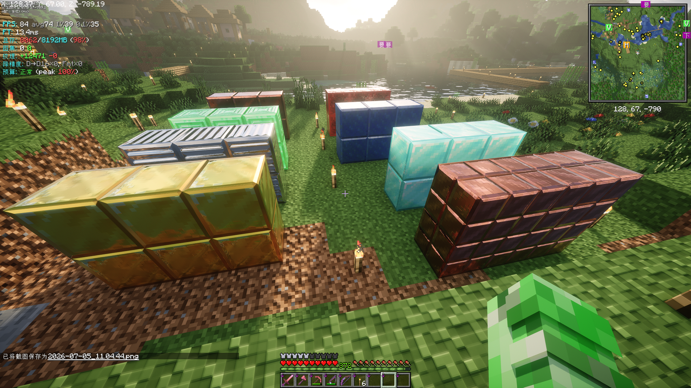
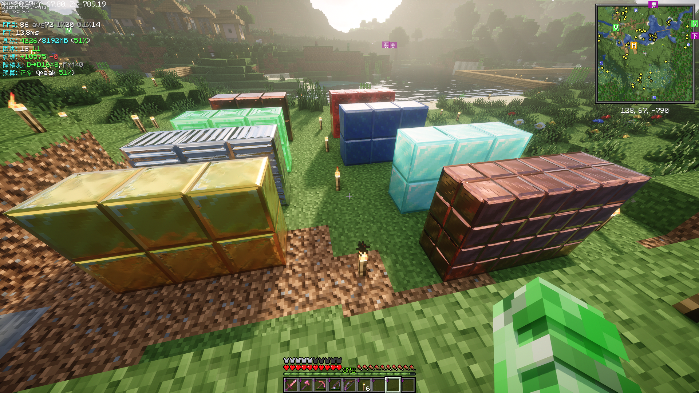

# VRAM Tweak Comparison
***
Language: [简体中文](README_CN.md) | **English**
***
This document shows the difference when `VRAM Tweak` is enabled. All screenshots were taken in the same scene with the same resource pack and shader settings.

---

## Test environment

- CPU: AMD Ryzen 5 5600
- RAM: 32GB 3200MT/s DDR4
- GPU: AMD Radeon RX6650XT
- Minecraft: v1.21.11 / 26.2 Fabric
- Resource pack: EXTREAL 0.0.2085
- Shader: Spring Shader (Chun v2), iterationRP Alpha, Helian-MMCO_r0.7.1

---

## Notes

- `On` means the VRAM optimization features of `VRAM Tweak` are enabled.
- `Off` means the optimization is disabled and the rendering behavior remains default.
- The main comparison points are memory usage, FPS, and whether the visual details remain stable.
- The top-left HUD shows VRAM usage for a direct comparison.

---

## Comparison

### Spring Shader

- `Spring-Off.png`: optimization disabled

- `Spring-On.png`: optimization enabled

### iterationRP

- `itRP-Off.png`: optimization disabled

- `itrp-On.png`: optimization enabled

### Helian-MMCO

- `Helian-MMCC-Off.png`: optimization disabled

- `Helian-MMCO-On.png`: optimization enabled

---