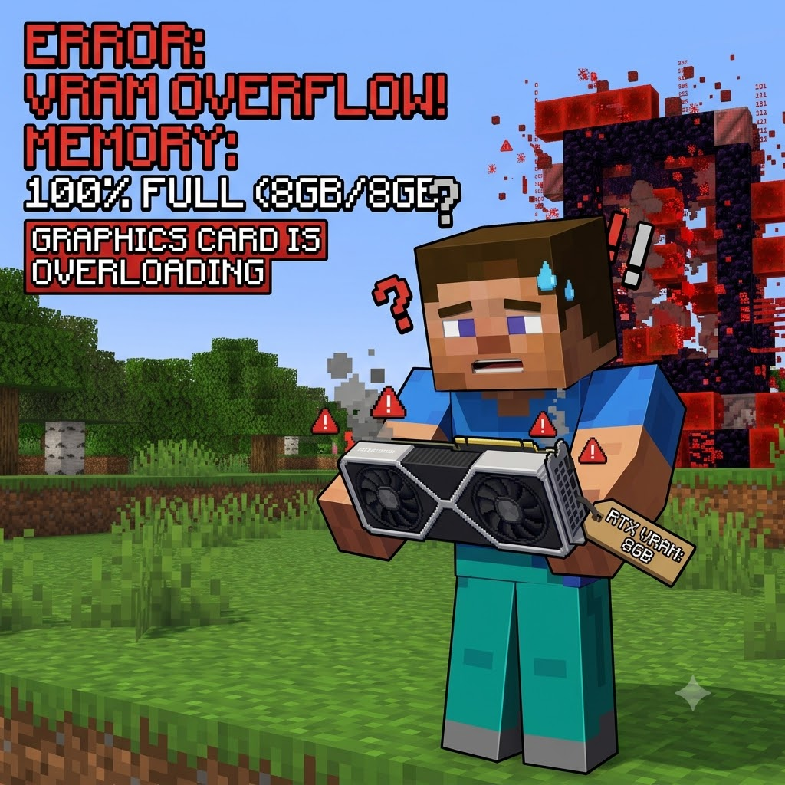

# VRAM Tweak

[**English**](README.md) | **中文**

> Minecraft 26.2 Fabric 显存优化模组 — 在不修改着色器或资源包的前提下降低 GPU 显存占用。

[](https://www.minecraft.net)
[](https://fabricmc.net)

---
  
<p align="center">
  
</p>

***
## 开发自述
我一开始想为我低端的AMD GPU做优化mod，因为我发现其帧数不稳定。我对此无能为力，正好借助现在AI，我可以按照想法做出来mod。  
然而随着开发，我发现其实时VRAM瓶颈。于是我改变方向，制作了这个为低VRAM优化的mod。  
这个mod理论上是通用的。  
对于那些使用4GB，6GB显存GPU的用户来说，这个能降低显存不足的卡顿。  
***
## 功能概述

VRAM Tweak 通过 Mixin 注入在 Blaze3D 引擎层面拦截 GPU 纹理创建。它截断超大纹理图集、降低深度缓冲精度、限制动画帧数，并在显存紧张时动态调整渲染距离 —— **全程不修改 Sodium、Iris 或任何第三方模组代码**。

| 功能 | 原理 | 实测触发情况 |
|------|------|-------------|
| **纹理图集上限** | 限制 `GpuDevice.createTexture()` 宽高 ≤ `maxAtlasSize` | ✅ 单会话 26 次截断（blocks.png 16384→4096） |
| **深度缓冲降精度** | D32_FLOAT → D16_UNORM 阴影贴图 | ✅ 单会话 10 次，节省 ~50%/ShadowMap |
| **颜色缓冲降精度** | RGBA16F → RGBA8（适配重型光影包） | ⚠️ 需高精度材质包/光影触发 |
| **阴影贴图上限** | 限制阴影贴图分辨率 ≤ `shadowMapMaxSize` | ⚠️ 原版 ≤1024，已在限制内 |
| **动画帧数限制** | 截断动画纹理最大帧数 | ✅ 稳定 |
| **粒子数量上限** | 全局粒子计数安全网 | ✅ 实验性 |
| **FSR CAS 锐化** | AMD 对比度自适应全屏锐化 | 🆕 实验性 — 补偿压缩模糊 |
| **VRAM 调速器** | 显存紧张时自动降低渲染距离 | ✅ 实验性 |
| **预算追踪** | 每帧轮询 VRAM 用量 + 可配置告警阈值 | ✅ 稳定 |

> ⚠️ **重要提示**：在 GUI 中开关 MOD 后，仅对**新创建的纹理**立即生效。已加载到显存中的纹理保持当前大小，需**重启游戏**才能重新以全分辨率加载。如果关闭 MOD 后显存占用没有上升，这是正常现象——重启游戏即可加载原始尺寸纹理。

---

## HUD 叠加层

实时性能数据叠加显示，**每个指标独立开关**：

| 开关 | 显示内容 |
|------|---------|
| FPS (平滑) | 0.5s 滚动窗口帧率 |
| FPS (平均) | 5s 滑动窗口均值 |
| 1% Low FPS | 最慢 1% 帧的 FPS——体感流畅度核心指标 |
| 0.1% Low FPS | 最慢 0.1% 帧——严重卡顿检测 |
| 帧时间 | 平均每帧毫秒数 |
| VRAM | 已用/总量 + 百分比（颜色编码） |
| Atlas 统计 | 纹理图集追踪数 vs 被截断次数 |
| 纹理分配 | GPU 纹理创建/释放计数 |
| 降精度计数 | 深度/格式降精度触发次数 |
| Budget 状态 | 告警状态 + 峰值使用率 |

通过 Cloth Config GUI 或 `config/vram-tweak.json` 配置。

---

## 命令

```
/vramtweak stats      — 在聊天栏输出当前 VRAM + FPS 统计
/vramtweak dump       — 写入完整诊断报告到磁盘
/vramtweak hud        — 开关 HUD 叠加层
/vramtweak benchmark  — 快速 VRAM 压力测试
```

---

## 实测效果

**测试环境：** AMD R5 5600 + 32GB DDR4 + RX 6650 XT 8GB  
**MC 26.2 + Fabric 0.19.3 + Sodium + Iris + 材质包/光影**  
**对比请参考这个:[对比文档](https://github.com/Coconutat/Minecraft-VRAM-Tweak/blob/imgs/README_CN.md)**

### 开启前后对比

| 指标 | 开启前 | 开启后 | 节省 |
|------|--------|--------|------|
| VRAM 峰值 | 7820 / 8192 MB (95.4%) | **4728 / 8192 MB (57.7%)** | ~3 GB |
| 稳定性 | 显存接近上限，频繁卡顿 | 预算告警 0 次 | 流畅可玩 |

### 纹理图集截断记录

单次游戏会话中，**26 次超限截断**：

| 图集 | 原始尺寸 | 截断后 | 节省 |
|------|---------|--------|------|
| `blocks.png` | 16384×8192 | **4096×4096** | ~240 MB |
| `armor_trims.png` | 16384×8192 | **4096×4096** | ~240 MB |
| `items.png` | 8192×4096 | **4096×4096** | ~64 MB |

> **总计：** 纹理图集 + 深度降精度（10 次），理论节省约 **2.5 GB 显存**，实测 VRAM 使用率从 95.4% 降至 57.7%。

### 测试材质包和光影
材质包: [EXTREAL](https://www.bilibili.com/video/BV1CBoFB1Es1/)（非免费，有试用版）  
光影: [春v2](https://modrinth.com/shader/spring-shaders)（公开发布）

---

## 依赖要求

| 依赖 | 类型 | 版本 |
|------|------|------|
| **Sodium** | 建议依赖 | 0.9.0+ |
| Iris | 软依赖 | 1.11+ *（光影兼容）* |
| Cloth Config | 软依赖 | 26.2+ *（GUI）* |
| ModMenu | 软依赖 | 20.0+ *（配置按钮）* |

**平台**：Windows、Linux  
**Java**：25+

> **兼容性：** 已在 Iris + C2ME + Lithium + 材质包/光影环境中稳定运行。

---

## GPU 支持

| GPU 厂商 | 自动检测 | VRAM 追踪 |
|---------|---------|----------|
| AMD | ✅ `GL_VENDOR` | ✅ `GL_ATI_meminfo`（KB 级精度） |
| NVIDIA | ✅ `GL_VENDOR` | ✅ `GL_NVX_gpu_memory_info`（KB 级精度） |
| Intel | ✅ `GL_VENDOR` | ❌ 无独立显存（核显使用系统内存），自动安全跳过 |

---

## 快速开始

1. 安装适用于 Minecraft 26.2 的 [Fabric](https://fabricmc.net/use/)
2. 安装 [Sodium](https://modrinth.com/mod/sodium) ```对于 26.2 版本，如果您安装了 Iris，则 Sodium 的版本必须为 0.9.0，因为 Iris 与高于 0.9.0 的版本不兼容。对于 1.21.11 版本，Sodium 必须为 0.8.13-beta-1 版本，因为 Iris 与高于 0.8.13-beta-1 的版本不兼容。如果您不使用 Iris，则可能没有此限制。
3. 安装 [Cloth Config API](https://modrinth.com/mod/cloth-config)
4. 安装 [Iris](https://modrinth.com/mod/iris)（此步骤为可选）
5. 将 `vram-tweak-x.x.x.jar` 放入 `mods/` 目录
6. 启动游戏 — 打开 Mod 菜单 → VRAM Tweak → 启用功能

---

## 配置文件

所有设置位于 `config/vram-tweak.json`。使用 Cloth Config GUI（Mod Menu → VRAM Tweak）进行交互式配置。

```jsonc
{
  "vram": {
    "enabled": true,           // VRAM 总开关
    "shadowMapMaxSize": 1024,  // 阴影贴图分辨率上限
    "formatDownscale": false,  // RGBA16F→RGBA8
    "depthDownscale": false,   // D32→D16
    "budgetTracking": false,   // VRAM 用量监控
    "budgetWarningPercent": 80 // 超过此百分比告警
  },
  "texture": {
    "animationLimit": false,
    "maxAnimationFrames": 32,
    "atlasSizeLimit": false,   // 纹理图集尺寸上限
    "maxAtlasSize": 4096
  },
  "governor": {
    "enabled": false,          // 动态渲染距离
    "hysteresis": 10,          // 回差百分比
    "minDistance": 4,          // 最低渲染距离
    "cooldownTicks": 100       // 冷却时间
  },
  "particle": {
    "enabled": false,
    "maxParticles": 2000
  },
  "hud": {
    "enabled": true,
    "showFps": true,
    "showFpsAvg": true,
    "showFps1Percent": false,
    "showFps01Percent": false,
    "showFrameTime": true,
    "showVram": true
    // ... 更多独立开关
  },
  "cas": {                          // 🆕 FSR CAS 锐化
    "enabled": false,
    "sharpness": 0.8
  }
}
```

---

## 构建

```bash
git clone <repo-url>
cd Minecraft-AMD-GPU-Tweak
./gradlew build
# 输出: build/libs/vram-tweak-x.x.x.jar
```

需要 JDK 25+ 和 Gradle 9.6+。

---

## 架构

```
Mixin 注入层
├── MixinGpuDevice_VRAMOptimize    → createTexture() 格式/尺寸上限
├── MixinGameRenderer_Metrics      → 逐帧统计 + VRAM 轮询
├── MixinGameRenderer_CAS          → FSR CAS 锐化处理
├── MixinSpriteContents_Animation  → 动画帧截断
├── MixinParticleEngine_Cap        → 全局粒子限制
├── MixinOptions_RenderDistance    → VRAM 调速器钩子
├── MixinGui_Hud                   → HUD 叠加层渲染
└── MixinMinecraft_Hud             → HUD 数据采集

核心模块 (src/main)
├── VRAMOptimizer          → 格式/尺寸策略引擎
├── VRAMGovernor           → 动态渲染距离控制器
├── MetricsEngine          → 环形缓冲区性能采样
├── VramFrameCounter       → 滑动窗口 FPS + 百分位低帧率
├── VerificationLogger     → 优化前后审计追踪
├── GPUDetector            → 厂商检测 + VRAM 查询
└── VRAMConfig             → 基于 Gson 的 7 段式配置

客户端模块 (src/client)
├── CasShader              → GLSL CAS 全屏后处理
├── VramTweakHud           → 单例叠加层渲染器
├── VramTweakCommand       → /vramtweak CLI
├── ClothConfigFactory     → GUI 集成
└── ModMenuIntegration     → Mod Menu 入口
```

---

## 许可证

Creative Commons Legal Code — 详见 [LICENSE](LICENSE)。
